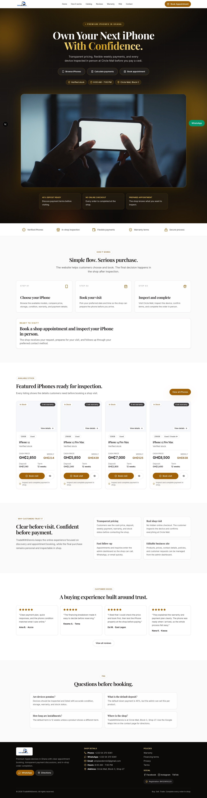
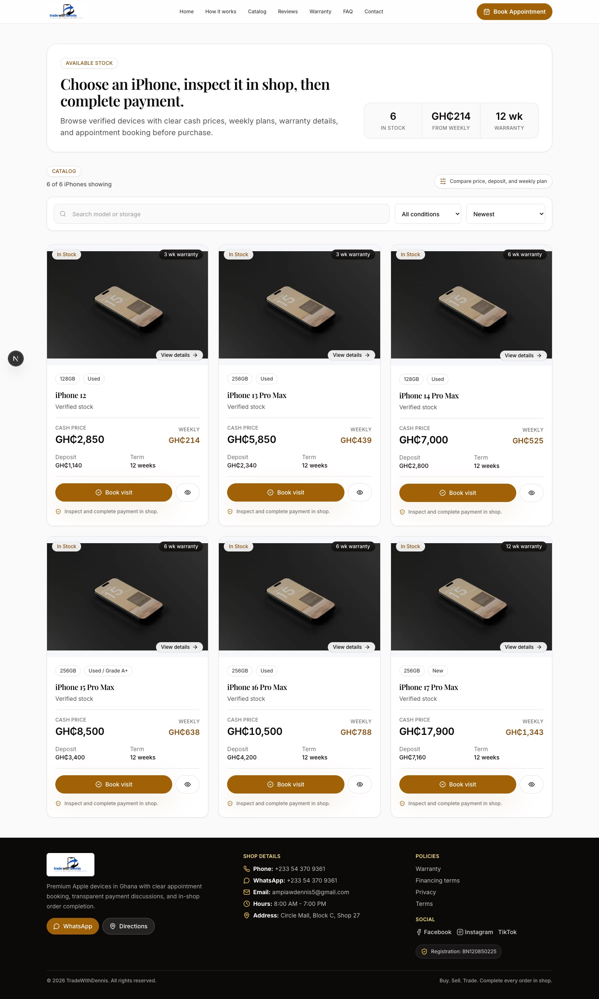
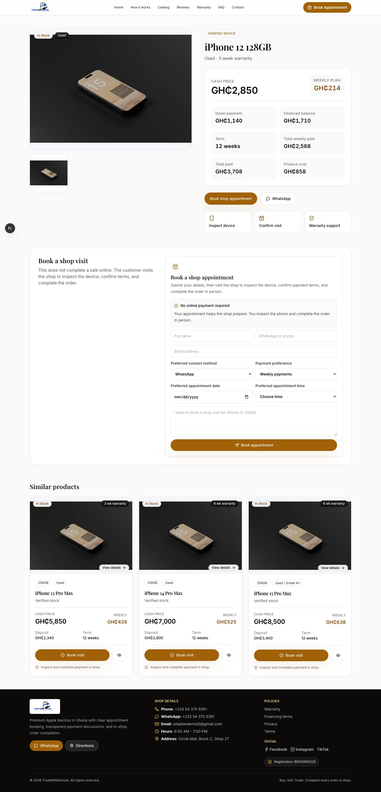
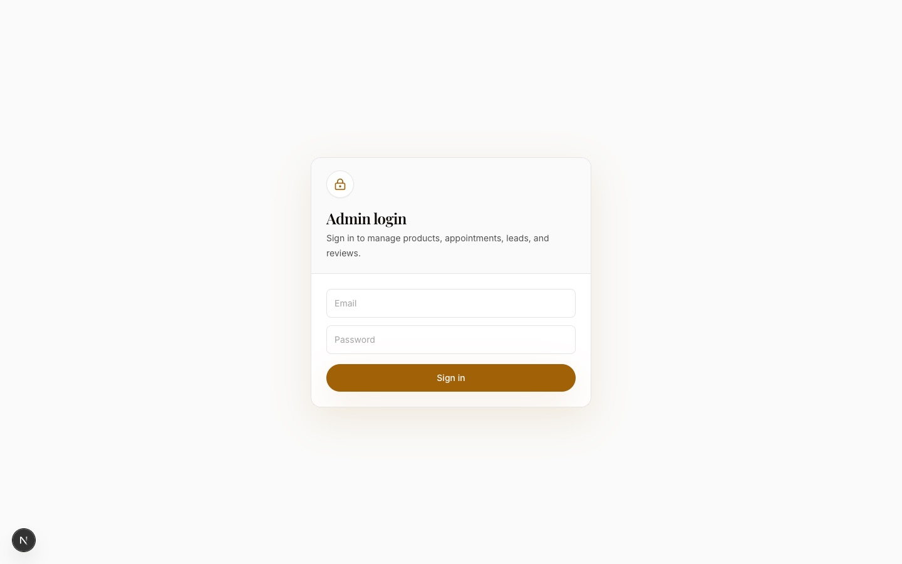

# TradeWithDennis

Premium iPhone sales and transparent financing website for Ghana, built with Next.js 15, TypeScript, Tailwind CSS, lucide-react, and Supabase.

## What This Project Does

TradeWithDennis is the online storefront for an in-person iPhone shop at Circle Mall, Accra. It lets customers browse verified used and new iPhones, see a transparent breakdown of cash price vs. weekly payment plans, and book a shop appointment to inspect the device and complete the purchase in person — there is no online checkout or payment collection on the site itself.

The public site is a marketing and booking funnel:

- Customers discover stock, compare condition/storage/price, and see exactly what a weekly payment plan costs before visiting.
- Booking a visit sends an appointment request to the shop (with WhatsApp/email follow-up) instead of taking payment online.
- After a completed visit, customers can be sent a secure link to leave a testimonial, which an admin approves before it appears on the homepage.

Behind the storefront is an admin dashboard (backed by Supabase with row-level security) where the shop owner manages products, pricing, site settings, leads, appointments, testimonials, and data exports/backups — so the catalog and terms can be updated without touching code.

## Screenshots

| Homepage | Catalog |
|---|---|
| [](docs/screenshots/homepage.jpg) | [](docs/screenshots/catalog.jpg) |

| Product Detail | Admin Login |
|---|---|
| [](docs/screenshots/product-detail.jpg) | [](docs/screenshots/admin-login.jpg) |

## Features

- Homepage with trust bar, product highlights, payment calculator, testimonials, FAQ, lead form, WhatsApp CTA, and mobile CTA.
- iPhone catalog with search, condition filter, stock filter, and sorting by newest, price, or weekly payment.
- Product detail pages with transparent financing breakdown.
- Contact, warranty, financing terms, privacy, and terms pages.
- Admin dashboard for products, settings, testimonials, leads, appointments, backups, and CSV exports.
- Post-visit testimonial flow: completed appointments can send a secure review link, then admins approve or decline submissions before they appear on the homepage.
- Supabase migrations with RLS policies and seed data.
- Vercel-ready metadata, Open Graph image, robots, sitemap, and JSON-LD.

## Environment Variables

Create `.env.local`:

```bash
NEXT_PUBLIC_SUPABASE_URL=your-supabase-url
NEXT_PUBLIC_SUPABASE_ANON_KEY=your-anon-key
SUPABASE_SERVICE_ROLE_KEY=your-service-role-key
NEXT_PUBLIC_SITE_URL=https://your-domain.com
ADMIN_EMAILS=your-admin-email@example.com
RESEND_API_KEY=your-resend-api-key
SHOP_NOTIFICATION_EMAIL=shop-notifications@example.com
EMAIL_FROM=TradeWithDennis <onboarding@resend.dev>
```

The public site renders from local seed data when Supabase variables are missing, which makes development easy before the database is connected.

For production email notifications, verify a sending domain in Resend and change `EMAIL_FROM` to an address on that verified domain.

## Supabase Setup

1. Create a Supabase project.
2. Run the migrations in `supabase/migrations` in order.
3. Create a Storage bucket for product images, then store the public image URLs in `products.image_urls`.
4. Create admin users in Supabase Auth.
5. Add every approved admin email to both `ADMIN_EMAILS` and the `public.admin_users` table.

The `003_admin_email_rls.sql` migration tightens database security so only emails in `public.admin_users` can manage products, leads, appointments, testimonials, and settings. To add another admin later, insert the email in Supabase SQL:

```sql
insert into public.admin_users (email)
values ('new-admin@example.com')
on conflict (email) do nothing;
```

The `004_testimonial_review_flow.sql` migration adds secure testimonial review links, pending/approved/declined testimonial moderation, and review-request records for completed appointments.

## Development

```bash
npm install
npm run dev:clean
```

Open `http://localhost:3000`.

Use `npm run dev:clean` during local development. It clears stale Next.js servers on ports `3000` and `3001`, removes the generated `.next` cache, then starts TradeWithDennis on `http://localhost:3000`.

Use `npm run verify` before committing or deploying. It stops any running local dev server before building so the generated `.next` cache does not get corrupted.

## Deployment

1. Push to GitHub.
2. Import the repository in Vercel.
3. Add the environment variables above.
4. Deploy.

For customer review, it is fine to use the temporary Vercel URL first. Before public launch with the final business domain, update `NEXT_PUBLIC_SITE_URL` to the real domain.

## Final Domain Launch Checklist

When the project is complete and the final domain is ready:

1. Add the custom domain to Vercel.
2. Update `NEXT_PUBLIC_SITE_URL` in Vercel to the final domain, for example `https://tradewithdennis.com`.
3. Verify the same domain in Resend.
4. Change `EMAIL_FROM` from `TradeWithDennis <onboarding@resend.dev>` to a verified sender on the domain, for example `TradeWithDennis <bookings@tradewithdennis.com>`.
5. Rotate/regenerate `SUPABASE_SERVICE_ROLE_KEY` before public launch because it was shared during setup.
6. Rotate/regenerate `RESEND_API_KEY` before public launch because it was shared during setup.
7. Replace the rotated keys in Vercel environment variables.
8. Redeploy the Vercel project.
9. Test public booking, admin login, appointment email notifications, and admin appointment updates on the live domain.

## Production Notes

- Publish reviewed warranty, privacy, financing, and purchase terms before accepting payments.
- Rotate any API keys that were pasted into chat before public launch.
